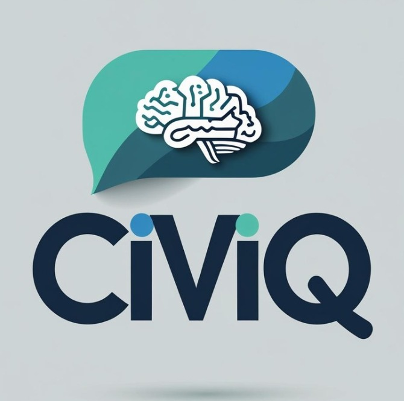

# 🛡️ CiviQ

### AI-Powered Business Resilience & Operational Intelligence Platform for Small Companies  
#### Secure. Collaborative. Built for everyday impact.**

  

---

## ⚡ At a Glance

**CiviQ** is an AI-powered assistant designed to help small businesses streamline their operations, uncover risks, and save hours of manual effort every week. It integrates with tools you already use — Google Drive, Notion, Slack, Sheets — and lets you ask natural-language questions like:

> “Summarize all customer complaints this month.”  
> “Show me invoices unpaid for 60+ days.”  
> “Draft a backup plan for vendor delays.”

Built with cutting-edge AI, secure data handling, and an easy-to-use interface, it becomes your business’s smartest, most reliable teammate.

---

## 🧠 About CiviQ

**CiviQ** is built for small companies and startups (10–50 person teams) to:

- ✅ Automate operational insights  
- ✅ Mitigate risk with early alerts  
- ✅ Foster local collaboration and resilience

By combining LLMs (like GPT-4), LangChain, and data connectors (Google, Notion, Slack), CiviQ gives you a smart, secure chat interface for your business data. It understands your operations and responds with meaningful answers.

Whether you're a founder, ops manager, or part of a local business alliance, CiviQ keeps your operations lean, resilient, and one step ahead.

---

## ✨ Key Features

| Feature | Description |
|--------|-------------|
| 🧠 **Natural Language Queries** | Ask business ops questions in plain English and get smart, actionable responses. |
| 🔗 **Integrations** | Connects with Google Drive, Sheets, Notion, Slack, Stripe, and more. |
| 📊 **Weekly Intelligence Reports** | Auto-generated summaries with trends, alerts, and KPIs. |
| 🔐 **Role-based Permissions** | Ensure the right people see the right data — securely. |
| 🧱 **Risk Mapping** | Get alerts on vendor risk, revenue drops, or supply chain delays. |
| 🤝 **Business Network Mode (Planned)** | Local businesses can opt-in to safely share limited data for resilience mapping. |
| 📦 **Offline Support** | Core functionality available offline with local data caching. |

---

## 🧰 Tech Stack

| Layer      | Tech |
|------------|------|
| **Frontend** | Next.js + Tailwind + shadcn/ui |
| **Backend** | Node.js (Express or tRPC), Firebase Functions *(Planned)* |
| **AI/LLM** | OpenAI GPT-4, LangChain Agents |
| **Vector DB** | Supabase pgvector / Weaviate |
| **Integrations** | Google APIs, Notion API, Slack, Stripe, Supabase |
| **Auth** | Clerk.dev or Auth0 (OAuth2 + JWT) |
| **Storage** | Supabase (Postgres + RLS), optional localStorage |
| **Hosting** | Vercel (frontend), Fly.io or Supabase (backend) |
| **Security** | AES-256 encryption, HTTPS, scoped OAuth tokens |

---

## 🧱 Architecture

Frontend (Next.js + Tailwind)
│
├── Civic Chat UI (React, shadcn)
├── Dashboard & Reports
│
├── Civic API Gateway (Node.js / Express / tRPC)
│   └── OAuth, Token Management, Access Control
│
├── LangChain Agent Layer (Python / JS)
│   └── GPT-4, Retrieval QA, Function Calling
│
├── Data Sources:
│   ├── Google Drive, Sheets
│   ├── Notion
│   ├── Slack
│   └── Stripe / APIs / Supabase
│
└── Vector Search (pgvector / Weaviate)

---

## 🔐 Security Principles

- OAuth 2.0 for safe user-based integrations

- Scoped tokens: Only the data you approve is used

- Zero developer access to sensitive data

- End-to-end encryption for documents

- Optional self-hosted or local-only mode

- Role-based data views (Owner / Ops / Viewer)

- Logs & rate limiting to prevent abuse

## 🎨 UI & UX Design

- Built with accessibility-first principles

- Responsive mobile & desktop support

- Light and dark modes

- Clean dashboard, chatbot-style query view, data-rich insights panel

- (Pictures coming soon)

## 🛠 Local Setup Guide (Basic)

We’ll guide you step-by-step to get CiviQ running locally. You’ll need basic knowledge of Git, Node.js, and APIs. Don’t worry — we’re here to help at each stage.

### 🧾 Prerequisites

- Node.js (v18+)

- pnpm or npm

- Git

- A Google developer project (for OAuth setup)

- Firebase/Supabase account for backend

### 🚀 Steps to Run Locally

- 1. Clone the repo
git clone https://github.com/your-org/civic-copilot.git
cd civic-copilot

- 2. Install dependencies
pnpm install

- 3. Set up environment
cp .env.example .env
Add your API keys and tokens here

- 4. Start dev server
pnpm dev

Visit: http://localhost:3000

## 🔐 Environment Variables

OPENAI_API_KEY=

SUPABASE_URL=

SUPABASE_ANON_KEY=

GOOGLE_CLIENT_ID=

GOOGLE_CLIENT_SECRET=

NOTION_TOKEN=

## 🧠 Example Prompts

Try asking:

- "Summarize customer issues in May."

- "What’s our cashflow trend last 3 months?"

- "Are any invoices unpaid past 60 days?"

- "Draft a risk plan for supplier shortage."

## 📦 Planned Features

- 🛎️ Notifications via Slack or Email

- 📅 Calendar Sync with Google Calendar

- 📍 Local Biz Directory & Shared Backup Plans

- 📈 AI Forecasts based on business trends

- 🗃️ CRM-like summaries for small teams

- 🧠 Future-Proofing & SDG Impact

## 🎯 Goal Alignment

- **SDG 8** - Smarter, safer work, less manual labor

- **SDG 9** - Small business innovation & digitization

- **SDG 11** - Resilient local economic ecosystems

- **SDG 13** - Predictive planning for climate disruptions

- **SDG 17** - Private B2B collaboration network

## 🤝 Contributing

Currently in private MVP stage. Once public:

Fork & open PRs for bugfixes or features

Submit ideas via GitHub Issues

All contributions must align with security best practices

## 👩‍💻 Authors

- **Shivoshita Jhalta**
- **Sarthak Jaiswal**
- **Hir Chirania**

Join us to learn, build, and launch real-world tools that matter.

##### 📩 Contact: [shivoshita@gmail.com](mailto:shivoshita@gmail.com)

"CiviQ exists to make small teams stronger, smarter, and safer — with AI you can trust."

